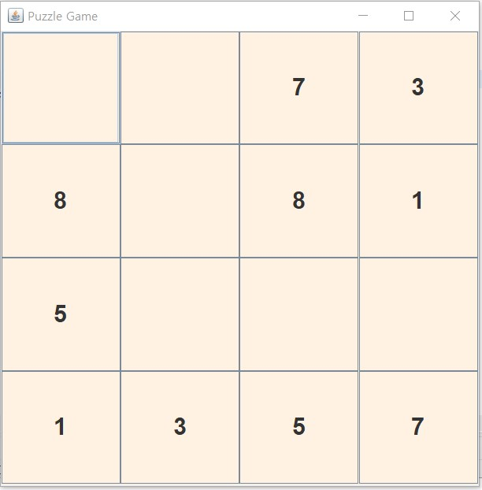

# Day 26 Homeowork
### > Quiz01.java
```java
package com.mega.homework;

import java.awt.Color;
import java.awt.Font;
import java.awt.GridLayout;
import java.awt.event.ActionEvent;
import java.awt.event.ActionListener;

import javax.swing.JButton;
import javax.swing.JFrame;
import javax.swing.JOptionPane;

class MyButton extends JButton{
	private int num;
	
	public int getNum() {
		return num;
	}

	public void setNum(int num) {
		this.num = num;
	}

	public MyButton(int num) {
		setNum(num);
	}
}

public class Quiz01 extends JFrame{
	private int[] numCnts = new int[8];
	private MyButton[] btns = new MyButton[16];
	private MyButton match;
	
	public void setNumCnts() {
		for(int i=0; i<numCnts.length; ++i) {
			numCnts[i] = 2;
		}
	}
	
	public void styleBtn(int idx) {
		btns[idx].setFont(new Font("Arial", Font.BOLD, 24));
		btns[idx].setFocusPainted(false);
		btns[idx].setBackground(new Color(255, 242, 227));
	}
	
	public void setBtns() {
		for(int i=0; i<btns.length; ++i) {
			int rand = (int)(Math.random() * 8) + 1;
			
			// 최대 2개까지 같은 숫자를 뽑을 수 있음
			while(numCnts[rand-1] < 1) {
				rand = (int)(Math.random() * 8) + 1;				
			}
			btns[i] = new MyButton(rand);
			styleBtn(i);
			
			--numCnts[rand-1];
			btns[i].addActionListener(new ActionListener() {
				
				@Override
				public void actionPerformed(ActionEvent e) {
					MyButton b = (MyButton)e.getSource();
					b.setText(String.valueOf(b.getNum()));
					
					
					if(null == match) {
						match = b;
						return;
					}
					
					if(b.getNum() != match.getNum()) {
						// 보여주는 상태로 0.5초 멈춰야하는데 안보여주고 sleep함...
						try {
							Thread.sleep(500);
						} catch (Exception e1) {
							JOptionPane.showMessageDialog(null, "Error");
						}
						match.setText("");
						b.setText("");
					}
					match = null;
				}
			});
		}
	}
	
	public Quiz01() {
		super("Puzzle Game");
		setDefaultCloseOperation(EXIT_ON_CLOSE);
		setLayout(new GridLayout(4, 4));
		setSize(400, 400);
		setLocationRelativeTo(null);
		
		setNumCnts();
		setBtns();
		
		// add btns
		for(MyButton b : btns) {
			add(b);
		}
		
		setVisible(true);
	}
	public static void main(String[] args) {
		new Quiz01();
	}
}
```
### Result 
