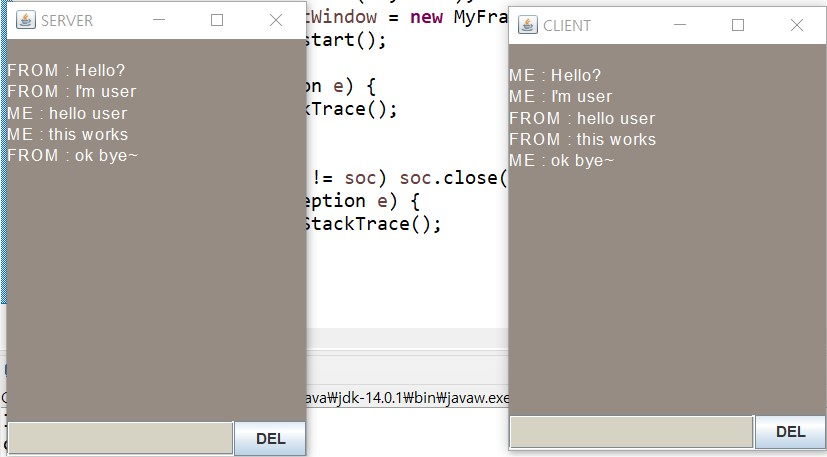
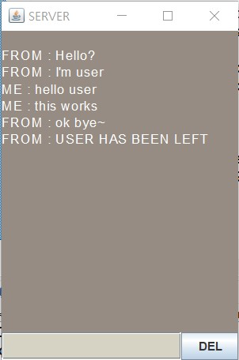

# Day 29 Homeowork
### > Server.java
```java
package com.mega.homework;

import java.net.ServerSocket;
import java.net.Socket;


public class Server {
	private static final int PORT = 50005;
	private static final String NAME = "SERVER";
	
	public static void main(String[] args) {
		ServerSocket sSoc = null;
		Socket soc = null;
		
		try {
			
			sSoc = new ServerSocket(PORT);
			System.out.println("Server Wating...");
			soc = sSoc.accept();
			System.out.println("User Connected!");
			
			MyFrame chatWindow = new MyFrame(soc, NAME);
			chatWindow.start();		
			
		} catch(Exception e) {
			e.printStackTrace();
		} finally {
			try {
				if(null != sSoc) {
					sSoc.close();
				}
			} catch(Exception e) {
				e.printStackTrace();
			}
		}
	}
}
```
### > Client.java
```java
package com.mega.homework;

import java.net.Socket;


public class Client {
	private static final int PORT = 50005;
	private static final String IP = "127.0.0.1";
	private static final String NAME = "CLIENT";
	
	public static void main(String[] args) {
		Socket soc = null;
		
		try {
			soc = new Socket(IP, PORT);
			MyFrame chatWindow = new MyFrame(soc, NAME);
			chatWindow.start();
			
		} catch(Exception e) {
			e.printStackTrace();
		} finally {
			try {
				if(null != soc) soc.close();
			} catch(Exception e) {
				e.printStackTrace();
			}
		}
	}
}
```
### > MyFrame.java
```java
package com.mega.homework;

import java.awt.BorderLayout;
import java.awt.Color;
import java.awt.Font;
import java.awt.event.ActionEvent;
import java.awt.event.ActionListener;
import java.awt.event.KeyEvent;
import java.awt.event.KeyListener;
import java.io.BufferedReader;
import java.io.InputStreamReader;
import java.io.PrintWriter;
import java.net.Socket;

import javax.swing.JButton;
import javax.swing.JFrame;
import javax.swing.JPanel;
import javax.swing.JTextArea;
import javax.swing.JTextField;

class InThread implements Runnable {
	private MyFrame frame;
	private Socket soc;
	private BufferedReader bufferedReader;
	
	public InThread(Socket soc, MyFrame frame) {
		setSoc(soc);
		setFrame(frame);
		setBufferedReader();
	}
	

	public BufferedReader getBufferedReader() {
		return bufferedReader;
	}

	public void setBufferedReader() {
		try {
			this.bufferedReader = new BufferedReader(new InputStreamReader(getSoc().getInputStream()));
		} catch(Exception e) {
			e.printStackTrace();
		}
	}

	public MyFrame getFrame() {
		return frame;
	}

	public void setFrame(MyFrame frame) {
		this.frame = frame;
	}

	public Socket getSoc() {
		return soc;
	}

	public void setSoc(Socket soc) {
		this.soc = soc;
	}


	@Override
	public void run() {
		try {
			while(true) {
				String msg = bufferedReader.readLine();
				
				if(null == msg) {
					System.out.println("disconnect!");
					break;
				}
				frame.update(msg);
			}
			
		} catch(Exception e) {
			frame.update("USER HAS BEEN LEFT");
		} finally {
			try {
				if(null != bufferedReader) bufferedReader.close();
			} catch(Exception e) {
				e.printStackTrace();
			}
		}
	}
	
}

public class MyFrame extends JFrame {
	private static final int FONT_SIZE = 14;
	private JTextArea textArea;
	private JPanel pan;
	private JTextField textField;
	private JButton button;
	private Socket soc;
	private PrintWriter printWriter;
	
	public void setPan() {
		textField = new JTextField();
		textField.setBackground(new Color(214,210,196));
		textField.setFont(new Font("Arial", Font.PLAIN, FONT_SIZE));
		textField.addKeyListener(new KeyListener() {
			
			@Override
			public void keyTyped(KeyEvent e) {}
			
			@Override
			public void keyReleased(KeyEvent e) {}
			
			@Override
			public void keyPressed(KeyEvent e) {
				if(KeyEvent.VK_ENTER == e.getKeyCode()) {
					
					try {
						printWriter = new PrintWriter(soc.getOutputStream());
						String msg = textField.getText();
						
						if(msg.length() < 0) {
							return;
						}
						System.out.println(msg);
						printWriter.println(msg);
						printWriter.flush();
						textArea.setText(textArea.getText() + "\nME : " + textField.getText());
						textField.setText("");
						
					} catch(Exception e1) {
						e1.printStackTrace();
					}
				}
				
			}
		});
		
		pan = new JPanel();
		button = new JButton("DEL");
		pan.setLayout(new BorderLayout());
		pan.add(textField, BorderLayout.CENTER);
		pan.add(button, BorderLayout.EAST);
		button.addActionListener(new ActionListener() {
			
			@Override
			public void actionPerformed(ActionEvent e) {
				textArea.setText("");
			}
		});
		
	}
	
	public void update(String msg) {
		textArea.setText(textArea.getText() + "\nFROM : " + msg);
	}
	
	public void setSoc(Socket soc) {
		this.soc = soc;
	}
	public void setTextArea() {
		textArea = new JTextArea();
		textArea.setEditable(false);
		textArea.setBackground(new Color(150,140,131));
		textArea.setForeground(Color.WHITE);
		textArea.setFont(new Font("Arial", Font.PLAIN, FONT_SIZE));
	}
	public MyFrame(Socket soc, String name) {
		super(name);
		setSoc(soc);
		setDefaultCloseOperation(EXIT_ON_CLOSE);
		setLayout(new BorderLayout());
		setSize(400, 600);
		setLocationRelativeTo(null);
		
		setPan();
		setTextArea();
		
		add(textArea, BorderLayout.CENTER);
		add(pan, BorderLayout.SOUTH);
		
	}
	
	public void start() {
		setVisible(true);
		try {
			
			Thread th = new Thread(new InThread(soc, this));
			th.start();
			th.join();
			
		} catch(Exception e) {
			e.printStackTrace();
		} finally {
			try {
				if(null != printWriter) printWriter.close();
			} catch(Exception e) {
				e.printStackTrace();
			}
		}
		
	}
}
```
### Result

