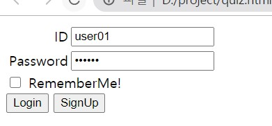
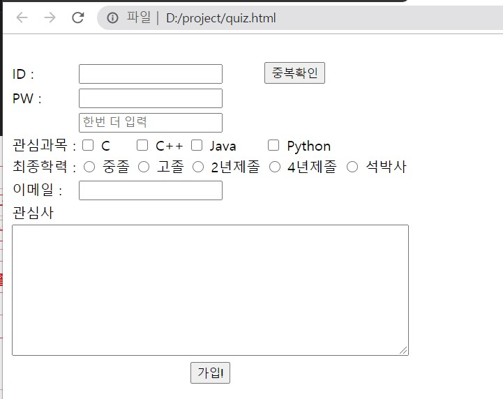

# Day 43 Homework

## Quiz01
  

<details>
<summary>Quiz01 html code</summary>
<p>

```html
<!DOCTYPE html>
<html>
<head>
    <meta charset = "UTF-8">
    <title>quiz</title>
</head>
<body>
    <form action="#">
        <table>
            <tr>
                <td align="right">ID</td>
                <td><input type="text"></td>
            </tr>
            <tr>
                <td align="right">Password</td>
                <td><input type="password"></td>
            </tr>
        </table>
        <input type="checkbox" name="check_box"> RememberMe!
        <br>
        <input type="button" value="Login">
        <input type="button" value="SignUp">
    </form>
</body>
</html>
```
</p>
</details>  

## Quiz02
  
<details>
<summary>Quiz02 html code</summary>
<p>

```html
<!DOCTYPE html>
<html>
<head>
    <meta charset = "UTF-8">
    <title>quiz</title>
</head>
<body>
    <form action="#">
        <table>
            <tr>
                <td>ID : </td>
                <td colspan="3"><input type="text" name="user_name"></td>
                <td><input type="button" value="중복확인"></td>
            </tr>
            <tr>
                <td>PW : </td>
                <td colspan="3"><input type="password" name="user_password"></td>
            </tr>
            <tr>
                <td></td>
                <td colspan="3"><input type="password" name="user_password" placeholder="한번 더 입력"></td>
            </tr>
            <tr>
                <td>관심과목 : </td>
                <td><input type="checkbox" name="subject"> C</td>
                <td><input type="checkbox" name="subject"> C++</td>
                <td><input type="checkbox" name="subject"> Java</td>
                <td><input type="checkbox" name="subject"> Python</td>
            </tr>
            <tr>
                <td>최종학력 : </td>
                <td><input type="radio" name="education"> 중졸</td>
                <td><input type="radio" name="education"> 고졸</td>
                <td><input type="radio" name="education"> 2년제졸</td>
                <td><input type="radio" name="education"> 4년제졸</td>
                <td><input type="radio" name="education"> 석박사</td>
            </tr>
            <tr>
                <td>이메일 : </td>
                <td colspan="3"><input type="eamil" name="user_email"></td>
            </tr>
            <tr>
                <td>관심사</td><br>
            </tr>
            <tr>
                <td colspan="6"><textarea name="favorite" cols="60" rows="10"></textarea></td>
            </tr>
            <tr>
                <td colspan="6" align="center"><input type="button" value="가입!"></td>
            </tr>
        </table>
    </form>
</body>
</html>
```
</p>
</details>