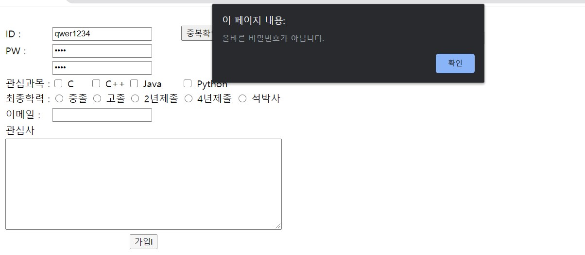

# Day 42 Homework

## Quiz01
  
### html code
```html
<!DOCTYPE html>
<html>
<head>
    <meta charset = "UTF-8">
    <title>quiz</title>
</head>
<body>
    <form action="#">
        <table>
            <tr>
                <td>ID : </td>
                <td colspan="3"><input type="text" name="user_name"></td>
                <td><input type="button" value="중복확인"></td>
            </tr>
            <tr>
                <td>PW : </td>
                <td colspan="3"><input type="password" name="user_password"></td>
            </tr>
            <tr>
                <td></td>
                <td colspan="3"><input type="password" name="user_password" placeholder="한번 더 입력"></td>
            </tr>
            <tr>
                <td>관심과목 : </td>
                <td><input type="checkbox" name="subject"> C</td>
                <td><input type="checkbox" name="subject"> C++</td>
                <td><input type="checkbox" name="subject"> Java</td>
                <td><input type="checkbox" name="subject"> Python</td>
            </tr>
            <tr>
                <td>최종학력 : </td>
                <td><input type="radio" name="education"> 중졸</td>
                <td><input type="radio" name="education"> 고졸</td>
                <td><input type="radio" name="education"> 2년제졸</td>
                <td><input type="radio" name="education"> 4년제졸</td>
                <td><input type="radio" name="education"> 석박사</td>
            </tr>
            <tr>
                <td>이메일 : </td>
                <td colspan="3"><input type="eamil" name="user_email"></td>
            </tr>
            <tr>
                <td>관심사</td><br>
            </tr>
            <tr>
                <td colspan="6"><textarea name="favorite" cols="60" rows="10"></textarea></td>
            </tr>
            <tr>
                <td colspan="6" align="center"><input type="button" value="가입!"></td>
            </tr>
        </table>
    </form>
</body>
</html>
```
### javascript code
```javascript
function submit_form(){
    var userId = document.getElementById('user-name');
    var userPw1 = document.getElementById('user-password-1');
    var userPw2 = document.getElementById('user-password-2');
    var idReg = /^[A-Za-z0-9+]{6,}$/; 
    var pwReg = /^(?=.*?[A-Z])(?=.*?[a-z])(?=.*?[0-9])(?=.*?[#?!@$%^&*-]).{8,20}$/;

    if(!userId.value || !userPw1.value || !userPw2.value){
        alert('사용하실 아이디와 패스워드를 모두 입력해주세요')
        return
    }

    if(!idReg.test(userId.value)) {
        alert('올바른 아이디가 아닙니다.');
        return;
    }

    if(userPw1.value !== userPw2.value){
        alert('비밀번호가 서로 다릅니다.');
        return;
    }

    if(!pwReg.test(userPw1.value)){
        alert('올바른 비밀번호가 아닙니다.')
        return;
    }

    alert('회원가입에 성공했습니다.');
}
```