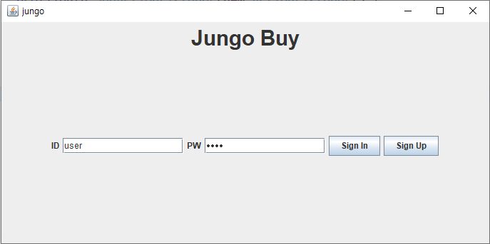
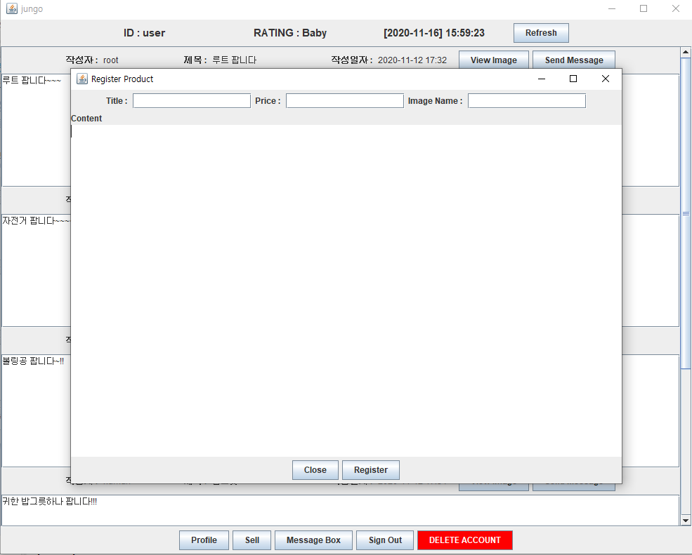
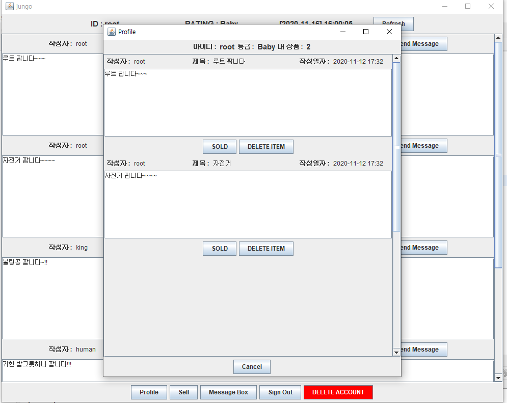
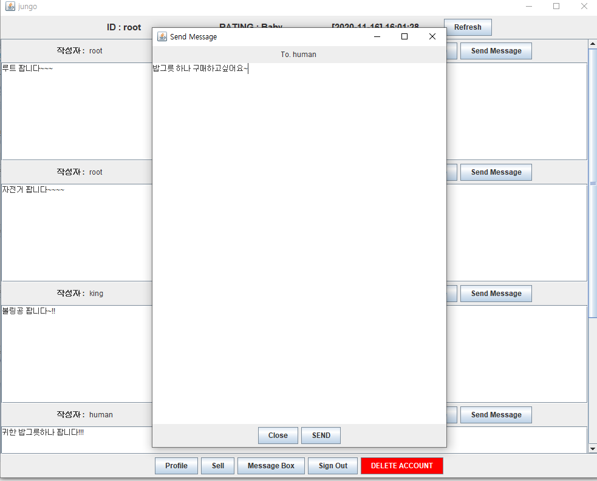
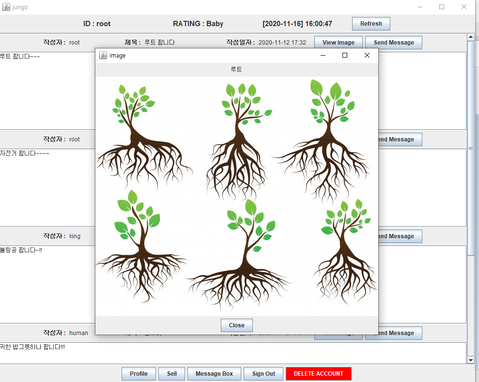
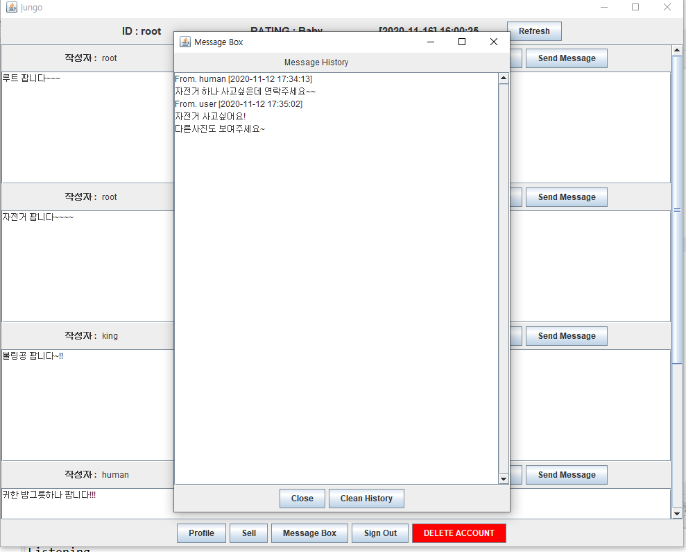

# 2020. 11 Java Project  
시중 중고거래 플랫폼과 유사한 애플리케이션을 Java swing GUI와 MariaDB를 활용해 구현한 JUNGO BUY 미니 프로젝트이며,  
해당 프로젝트의 [Java Docs](https://dooye0ng.github.io/megaIT/project/AppProject/doc/)도 함께 제작했습니다.

## 개요
사용자들간의 중고거래를 도와주는 애플리케이션이며

1. 로그인, 로그아웃 및 회원탈퇴
2. 물품 등록  
3. 현재 각 유저들이 등록해놓은 물품들 조회
4. 본인 프로필 조회
5. 본인 등록 물품 삭제 및 판매완료 처리
6. 사용자간 쪽지 기능
7. 중고물품 사진 조회 기능
8. 판매 기록(횟수)을 기준으로한 유저의 중고거래 등급제   

등의 기능을 포함하고 있습니다.

## 개발 환경
- 언어 : Java 1.8 (eclipse - GUI : swing)
- 데이터베이스 : MariaDB 10.5

## 프로젝트 기간
2020년 11월 6일 ~ 2020년 11월 13일 (8일)

## 힘들었던 점
기술적으로 힘들었던 점은 클라이언트-서버 구조로 다양한 기능을 하진 애플리케이션을 구현하려고 하다보니 소켓 통신과 쓰레드 구현이 필수적이었는데, 프로젝트를 막 시작했을 때 소켓과 쓰레드 프로그래밍에 익숙하지 않아 많은 시간을 투자해야 했습니다.  
또 처음으로 진행한 프로젝트였기 때문에 설계면에서 많이 부족했습니다. 프로젝트를 구상하자마자 설계를 철저하게 하지 않고 생각나는대로 기능이나 프레임 등을 구현하다보니 각각의 기능 및 프레임들 사이에 많은 충돌이 있었고, 이를 수정하여 다시 개발하는 과정에 정말 많은 시간이 들었고 끊임없이 에러가 발생했기 때문에 프로젝트의 진행이 너무 느렸습니다. 그래서 1/3정도 진행했던 것들을 모두 포기하고 다시 설계단계로 돌아가 데이터베이스, 프레임 흐름 및 각 프레임의 기능 등을 확실하게 설계한 후 다시 프로젝트를 진행해야 했습니다. 이번 미니 프로젝트를 통해 설계의 중요성을 확실하게 깨달았기 때문에 앞으로의 모든 프로젝트는 모든 설계를 확실하게 하는 것을 시작으로 해야겠다고 다짐했습니다.  
그리고 구현한 기능들 중 한 가지 아쉬운 점은, 물품을 등록할 때 사진 등록 기능을 구현함에 있어 fileChooser클래스의 존재를 뒤늦게 알았고, 프로젝트를 1주일내로 끝내야했기 때문에 시간적인 이유때문에 이를 사용하지 못한 아쉬움이 있습니다.  

## 애플리케이션 시연 영상  
- (Youtube Link)  
 

## 애플리케이션 사용 화면
- 로그인 화면  
  
  
- 메인 화면  
  
  
- 상품 등록 화면  
  
  
- 프로필 정보 확인 화면  

- 쪽지 보내기 화면  
  
  
- 사진 확인 화면  
  
  
- 쪽지함 확인 화면  
  
  

