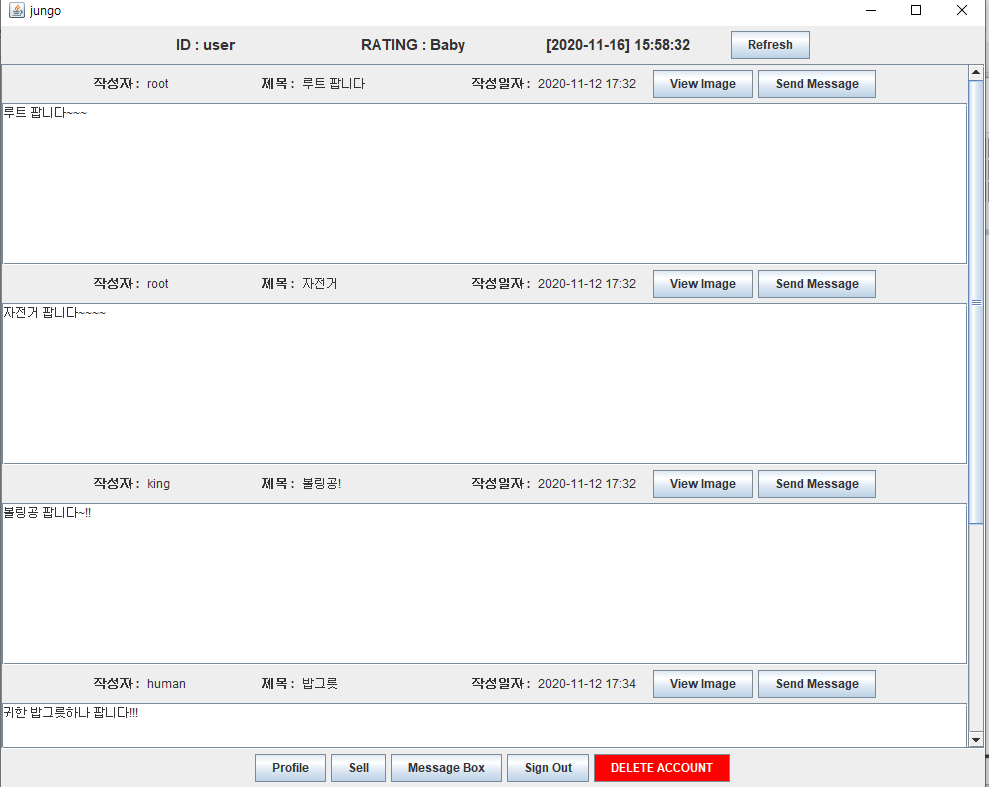

# Jungo-Market Project
## 2020. 11 Java Project  
시중 중고거래 플랫폼과 유사한 애플리케이션을 Java swing GUI와 MariaDB를 활용해 구현한 JUNGO BUY 미니 프로젝트이며,  
해당 프로젝트의 [Java Docs](https://dooye0ng.github.io/megaIT/project/AppProject/doc/)도 함께 제작했습니다.

### 개요
사용자들간의 중고거래를 도와주는 애플리케이션이며

1. 로그인, 로그아웃 및 회원탈퇴
2. 현재 각 유저들이 등록해놓은 물품들 조회
3. 본인 프로필 조회
4. 본인 등록 물품 삭제 및 판매완료 처리
5. 사용자간 쪽지 기능
6. 중고물품 사진 조회 기능
7. 판매 기록(횟수)을 기준으로한 유저의 중고거래 등급제   

등의 기능을 포함하고 있습니다.

### 개발 환경
- 언어 : Java 1.8 (eclipse - GUI : swing)
- 데이터베이스 : MariaDB 10.5

### 프로젝트 기간
2020년 11월 6일 ~ 2020년 11월 13일 (8일)

### 애플리케이션 시연 영상  
- (Youtube Link)  
 

### 애플리케이션 사용 화면
- 로그인 화면  
  
  
- 회원가입 화면  
  
  
- 메인 화면  
  
  
- 상품 등록 화면  
  
  
- 프로필 정보 확인 화면  

- 쪽지 보내기 화면  
  
  
- 사진 확인 화면  
  
  
- 쪽지함 확인 화면  
  
  

